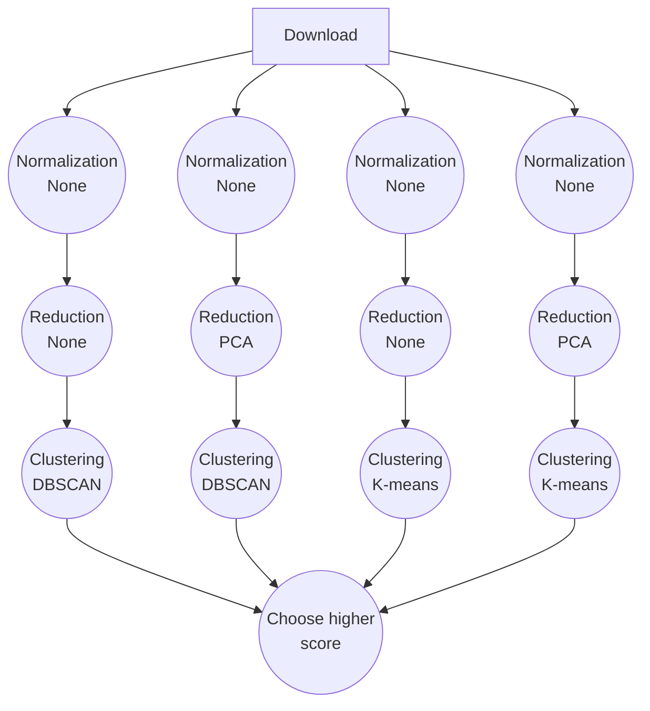

# Clustering with CWL

For this tutorial, students are asked to create a CWL workflow. The workflow applies various clustering techniques to a dataset, experimenting with different combinations of normalization and dimensionality reduction, including the option to skip either or both.
Below is a representation of the workflow graph:



The skeleton of the workflow is already provided:

- `main.cwl` file contains the entry point of the workflow and introduces parallelism (the replicas of the branches shown in the figure). _The student must complete the step definitions and define the scatter over the three lists: clustering_techniques, normalization_techniques, and reduction_techniques_. Refer to some [examples](https://www.commonwl.org/user_guide/topics/workflows.html#scattering-steps) and the official [documentation](https://www.commonwl.org/v1.0/Workflow.html#WorkflowSep) for guidance.
- `clustering_pipeline.cwl` file defines a single branch, i.e., normalization, reduction, and clustering. _The student must complete the step definitions and workflow inputs_.
- `config.yml` describes the workflow input parameters.
- `clt` directory contains the step definitions that execute applications. In CWL, these are called `CommandLineTool`  
  - `clt/clustering.cwl` defines the execution of the application that performs clustering. _This file is already fully provided to the student_.
  - `clt/download.cwl`  defines the execution of the application that downloads the dataset. This step runs a Python script provided as input. The script takes two positional string arguments: the repository name and the output name. _The student must complete this definition_.
  - `clt/normalization.cwl` defines the execution of the application that applies normalization to the downloaded data. This step also runs a Python script provided as input. The script takes two positional inputs: a file (the downloaded dataset) and a string (the normalization method, e.g., `none`, `ln_pe`, etc.). Additionally, it accepts two keyword arguments: `--outname` (the name of the output) and `--seed` (to set a seed for reproducibility). _The student must complete this definition_.
  - `clt/reduction.cwl` defines the execution of the application that applies dimensionality reduction to the normalized data. _This file is already fully provided to the student_.
- `et` directory contains step definitions that manipulate data using pure JavaScript expressions. These computations are executed by the Workflow Manager. In CWL, such steps are known as `ExpressionTool`.
  - `et/choose_higher_score.cwl`contains pure JavaScript code to find the highest score and return the corresponding plot. _This file is already fully provided to the student_.
- `scripts` directory contains the Python scripts used in the workflow steps. These scripts are already fully provided to the students.

## Execute the workflow 

The workflow can then be executed using `cwltool`, the CWL reference implementation. To execute the workflow, run the following commands:

```bash
python -m venv cwl-venv
source cwl-venv/bin/activate
pip install -r requirements.txt

cwl-runner main.cwl config.yml
```
